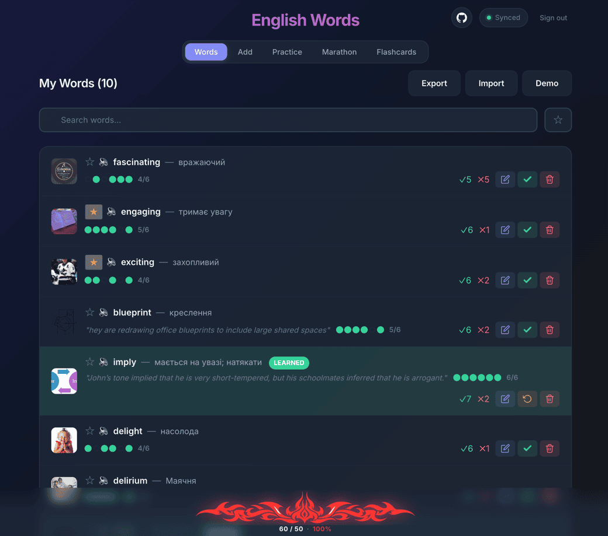

# English Words

**Live:** https://tavor118.github.io/english_words/

A personal vocabulary trainer. Add words with translations, drill them through six exercises (Quiz, Reverse Quiz, Typing, Listening, Match Pairs, Scrambled), review with spaced-repetition flashcards, and track per-word progress. React 19 + TypeScript + Vite, no backend — data lives in `localStorage` with optional Google Drive sync.

## Table of Contents

- [Features](#features)
- [Learning Model](#learning-model)
- [Keyboard Shortcuts](#keyboard-shortcuts)
- [Data Storage](#data-storage)
- [Google Drive Sync (optional)](#google-drive-sync-optional)
- [Local Development](#local-development)
- [Deployment](#deployment)



## Features

- Add / edit / delete / search / tag / favorite words
- Auto-translate (MyMemory), auto-image (Wikipedia), spell check, pronunciation
- Import / Export as JSON
- Dark mode + responsive layout (down to ~320px)

## Learning Model

### Six exercises

To **learn** a word, answer it correctly once in each:

- **Quiz** — EN word → pick UA translation (multiple choice).
- **Reverse Quiz** — UA → pick EN (multiple choice).
- **Typing** — UA → type EN.
- **Listening** — hear it → type EN.
- **Match Pairs** — tap matching EN/UA cards.
- **Scrambled** — arrange shuffled letters into the EN word.

Each session pulls only words where that specific exercise is not yet passed. Wrong answers carry no penalty. Once all six are passed, the word is flagged **Learned** and excluded from future sessions until you Reset it.

### Practice vs Marathon

- **Practice** drills one exercise at a time on every unpassed word.
- **Marathon** cycles through all six in fixed order, up to **10 words per step** (Match Pairs is capped at 5 pairs). Steps with too few eligible words are skipped silently.

### Flashcards (spaced repetition)

Separate review track, unrelated to the six-exercise progress. New words start with a 1-day interval; **Got It** multiplies by 2.5× (capped at 365 days), **Don't Know** resets to 1 day. Sessions prioritize overdue words.

### Daily goal

A bottom progress bar tracks **1 point per correct answer** (Match Pairs awards per pair). Goal is 50/day and resets at local midnight. Stored under `english-words-daily-progress`; not synced to Drive.

## Keyboard Shortcuts

- **Quiz / Reverse Quiz** — `1`–`4` to pick, `Enter` to advance.
- **Typing / Listening** — type, `Enter` to check, `Enter` again to advance.
- **Match Pairs** — `1`–`5` for the EN column, `6`–`9` / `0` for the UA column.
- **Scrambled** — type letters (auto-placed), `Backspace` to undo, `Enter` to advance.
- **Flashcards** — `Enter` / `Space` to flip; once flipped, `K` for Got It, `D` for Don't Know.

## Data Storage

Words live in `localStorage` under `english-words`. Use **Export** / **Import** for JSON backups. Legacy entries (missing `progress` / `learnedAt`) are migrated transparently on load.

## Google Drive Sync (optional)

Syncs your word list to **your own Google Drive** so the same data is available on desktop and mobile. The file is stored in Drive's hidden `appDataFolder` — only this app can read it, and you can revoke access anytime from your Google account.

If `VITE_GOOGLE_CLIENT_ID` is not set, the app stays local-only and the sync UI is hidden.

### One-time setup

1. Open [Google Cloud Console](https://console.cloud.google.com/) and create / pick a project.
2. Enable the **Google Drive API**: [APIs & Services → Library → Google Drive API](https://console.cloud.google.com/apis/library/drive.googleapis.com) → Enable.
3. Configure the [OAuth consent screen](https://console.cloud.google.com/apis/credentials/consent):
   - User Type: **External**
   - Add the `.../auth/drive.appdata` scope
   - Add yourself under **Test users** (see below)
4. Create credentials at [Credentials → Create credentials → OAuth client ID](https://console.cloud.google.com/apis/credentials):
   - Application type: **Web application**
   - Authorized JavaScript origins: `http://localhost:5173` (dev) and your GitHub Pages origin (e.g. `https://<your-username>.github.io`).
5. Add the client ID to a `.env` file at the repo root:
   ```
   VITE_GOOGLE_CLIENT_ID=xxxxxxxxxxxx.apps.googleusercontent.com
   ```
6. For Pages deployment, add `VITE_GOOGLE_CLIENT_ID` as a repo Variable (Settings → Secrets and variables → Actions → Variables) and reference it in `.github/workflows/deploy.yml`.

### Adding a test user

While the OAuth app is in **Testing** mode (the default), only emails on the Test users list can sign in — `drive.appdata` is a sensitive scope, so anyone else gets a 403. Cap is 100; going beyond that requires Google verification.

1. Open the [OAuth consent screen](https://console.cloud.google.com/apis/credentials/consent) for your project.
2. Scroll to **Test users** → click **+ Add users**.
3. Enter the Gmail address(es) to allow, one per line.
4. Click **Save**. The user can now sign in (allow a minute for propagation).

### How sync works

- **Storage** — file `words.json` in Drive's hidden `appDataFolder`. Scope is `drive.appdata` only.
- **Initial sync per device** — downloads remote (if any), **merges** with local, and uploads the merged result back if it differs. If no remote file exists, the local list is uploaded as-is. Driven by a `english-words-drive-signed-in` flag in `localStorage` so reloads silently resume.
- **Merge rules** — words matched by `id` (UUID). Local-only and remote-only entries are kept. On collision: progress is OR'd per exercise; counters/intervals/`nextReviewAt` take `max`; `lastReviewedAt` takes latest; `learnedAt` takes earliest; `tags` set-union; `favorite` OR'd; string fields prefer non-empty with local winning ties.
- **Ongoing uploads** — debounced ~2s after each change; deduplicated by JSON comparison. If the access token has silently expired, the upload is skipped (next change retries).
- **Conflict policy** — last-write-wins after the initial sync; no per-change merge. Two devices editing simultaneously will lose changes from whichever uploads first.
- **Status** — UI surfaces `disabled` / `signed-out` / `syncing` / `idle` / `error`.

## Local Development

```bash
npm install
npm run dev        # http://localhost:5173
npm test           # vitest
npm run lint
npm run build
```

Code is organized as: `components/` (UI), `hooks/` (state machines), `utils/` (pure helpers), `test/` (vitest specs).

## Deployment

Auto-deploys to GitHub Pages on push to `main` via `.github/workflows/deploy.yml`. One-time setup: **Settings → Pages → Source: GitHub Actions**.
